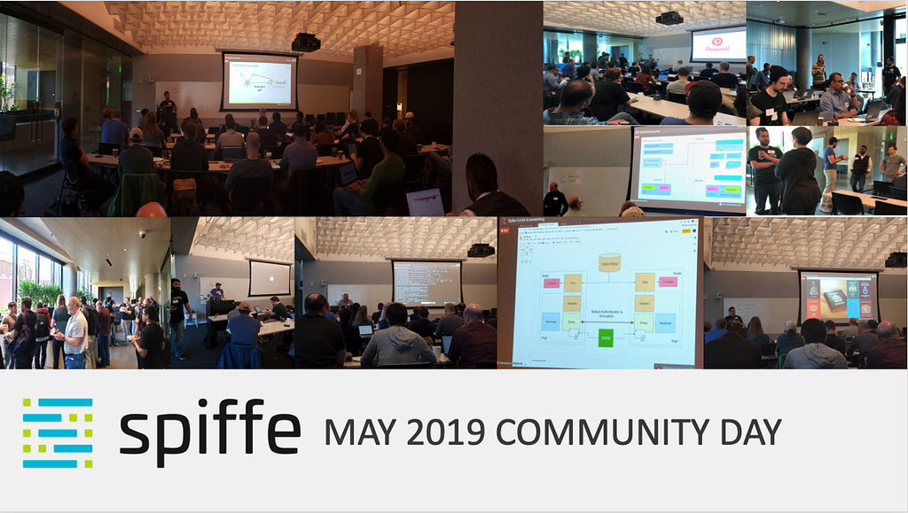

Over the past few months, we’ve watched the SPIFFE and SPIRE projects grow in popularity and maturity as more and more organizations look at these projects to deliver service identity for cloud- and container-deployed services. The SPIFFE slack channel has gained over 100 new members since the last community day in November. [By many measures](https://spire.devstats.cncf.io/d/3/stars-and-forks-by-repository?orgId=1) from the number of public forks to contributors, the project has roughly doubled in the last 12 months.

Last Friday Pinterest and Scytale hosted the May 2019 SPIFFE Community Day. In addition to project updates, this event featured fantastic demos and case studies from Uber, Square, Tigera, and Scytale. Here’s a recording of the event:

[Watch on YouTube](https://www.youtube.com/watch?v=H5IlmYmEDKk)

Key sessions are listed below:

Latest [**Project Updates**](https://youtu.be/H5IlmYmEDKk?t=1541)(SPIFFE + SPIRE)

**End User Talks:**

-   [**SPIRE @ Square:**](https://youtu.be/H5IlmYmEDKk?t=2585) Matthew McPherrin talked about how Square is using SPIFFE and SPIRE to ensure secure communications across hybrid infrastructure services.
-   [**SPIRE Scheduler Integration @Uber**:](https://youtu.be/H5IlmYmEDKk?t=4703) Tyler Dixon talked about his work integrating SPIRE with workload schedulers and lessons learned along the way.

**Demos:**

-   Scott Emmons (Scytale) gives a detailed look at the new security model for [**SPIRE on Kubernetes**](https://youtu.be/H5IlmYmEDKk?t=6812).
-   [**Transparent Service Authentication and Authorization With Calico, Envoy and SPIRE**](https://youtu.be/H5IlmYmEDKk?t=7812) This demo from Spike Curtis (Tigera) shows how Calico, Envoy and SPIRE can be used to deliver unified Layer 4 and Layer 7 authorization policies.
-   [**Securely extending the Istio Service Mesh into new environments with SPIRE**](https://youtu.be/H5IlmYmEDKk?t=8896) This demo from Eugene Weiss and Max Lambrecht (Scytale) shows how services running outside of a Kubernetes cluster can securely authenticate to those running in an Istio service mesh on-cluster using SPIRE.

Slides from the event are below:

[View on Google Docs](https://docs.google.com/presentation/d/1KQgzo4qw2fwDBp6WVV81V4ETOZfuDBX8zrM4MyLsrmQ/edit?usp=sharing)

[Join us on Slack](https://slack.spiffe.io/) to share ideas, ask questions, and learn from those using SPIFFE and SPIRE to implement zero-trust security.

*This post was [originally published on the SPIFFE Medium blog](https://medium.com/spiffe/re-cap-spiffe-community-day-spring-2019-ad1458fd1dc9).*
