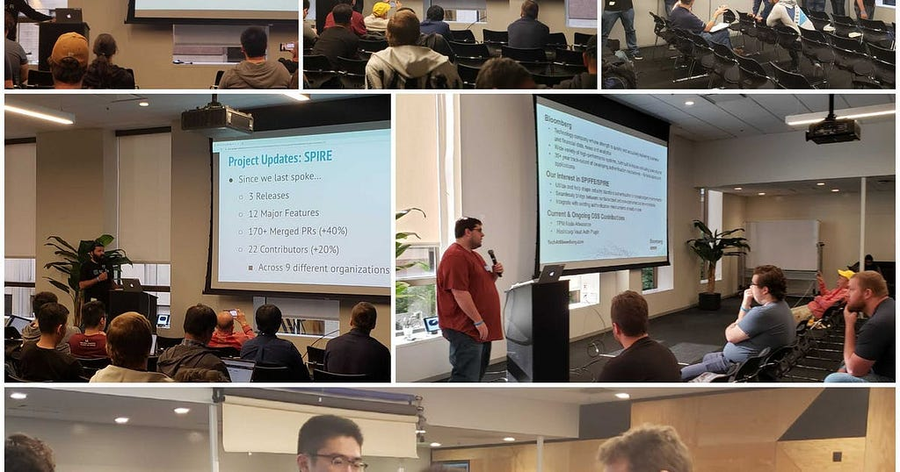

Last month Uber and Scytale hosted our Fall 2019 SPIFFE Community Day**,** an opportunity for our project committers (which now include Bloomberg and Amazon), maintainers and users to meet, learn about the latest innovations in the project, and share experience on how SPIFFE and SPIRE are being used in the real world to strengthen service to service authentication across heterogeneous environments**.**

The event itself was our largest ever, with more and 200 registered attendees between Uber’s offices in San Francisco and online. In addition to project updates, the day featured some fantastic demos and talks from Bloomberg, Uber, NGINX (F5 Networks), Decipher Studios, and Scytale.

Key sessions and videos are listed below:

**Introductions, Roadmap, and Project Updates:**

-   [**Community Introductions**](https://www.youtube.com/watch?v=bwwtUgdKr1k)**:** Engineers from Uber, Bloomberg, and Squarespace share why they are interested in adopting SPIFFE and SPIRE.
-   [**SPIFFE Look-Back and Forward:**](https://www.youtube.com/watch?v=VHxUFmNQxks) Andrew Jessup (Scytale) provided a recap of SPIFFE and talked about how SPIFFE is now much more than service to service authentication particularly with SPIFFE and OIDC federation. Recent releases allow SPIFFE to authenticate to a growing number of technology services and systems including databases, cloud service providers, and Service Mesh. He also announced a working group for transitive identity(sometimes called delegated Identity). You [can join the working group here](https://groups.google.com/a/spiffe.io/forum/#!forum/transitive-identity-wg).
-   [**SPIFFE + SPIRE Project Updates:**](https://youtu.be/29cszjxsZqo) Evan Gilman and Andrew Harding provided updates on the SPIFFE and SPIRE projects including a preview of the upcoming SPIRE 0.9 release.

**Bringing SPIFFE and SPIRE to more environments:**

-   [**TPM Node Attestation with SPIRE**:](https://youtu.be/30S0sKRxzjM) Peyton Walters (Bloomberg) talked about the agent and server plugins for SPIRE the Bloomberg team build to allow TPM 2-based node attestation for secure node identity in their on-premises infrastructure.
-   **Authenticating Hadoop Workloads with SPIRE** — Will Salisbury (Uber) presented how to authenticate requests to a production service from a Hadoop workload. (Recording not available)

**Using SPIRE as the Foundation for Service Mesh:**

-   [**Integrating NGINX and SPIRE:**](https://youtu.be/plRkDK5xFpM) Faisal Memon (Nginx) talked about how the NGINX team (now part of F5 Networks) is integrating SPIFFE and SPIRE as the identity foundation of their upcoming Service Mesh to establish zero trust between services running in the mesh and provide interoperability with Istio and other distributed environments.
-   [**Securing Grey Matter: SPIFFE/SPIRE in a Hybrid Mesh:**](https://youtu.be/1TlEO0xO8jw) Charles Strahan (Decipher Technology Studios) talked about how they have integrated also SPIRE into their Service Mesh. He shared details on the implementation and the role the projects play in authentication and authorization within their Service Mesh.

**Using SPIRE to authenticate directly to cloud platforms and databases:**

[Join us on Slack](https://slack.spiffe.io/) to share ideas, ask questions, and learn from those using SPIFFE and SPIRE to implement zero-trust security.

*This post was [originally published on the SPIFFE Medium blog](https://medium.com/spiffe/re-cap-spiffe-community-day-fall-2019-669d2a17f301).*
