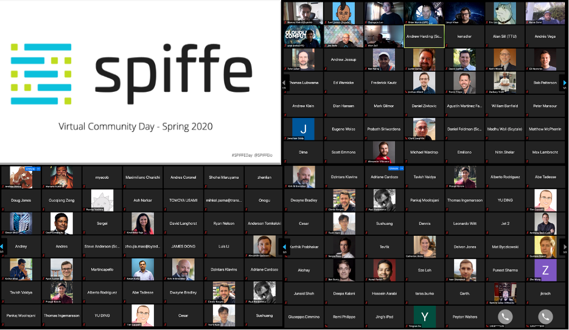

### Compelling case studies, increasing adoption, and big plans for the future …

On April 24, 2020, the [**SPIFFE**](https://www.spiffe.io) community held its largest gathering of contributors and users to date. This gathering connects project committers, maintainers, and users, showcases recent project innovations, and facilitates an exchange of experiences regarding how SPIFFE and [**SPIRE**](https://github.com/spiffe/spire) are put into practice to address cross-workload authentication across heterogeneous IT environments.

The event, held 100% online for the first time, had 300+ registered attendees from 120 organizations (100% YoY growth). The event also featured presentations from end-users like [**ByteDance**](https://www.bytedance.com/en/) (makers of [**TikTok**](https://www.tiktok.com/)), [**Square**](https://squareup.com/us/en), [**TransferWise**](https://transferwise.com/us), and [**Uber**](https://www.uber.com/)**,** and also featured a remarkable demo showcasing SPIRE and [**Open Policy Agent**](https://github.com/open-policy-agent/opa) providing an integrated solution for authentication and authorization.

In case you missed it or want to watch it again, no need to worry. Below you will find the video highlights:

**Introductions, Roadmap & Project Updates**

[Watch on YouTube](https://www.youtube.com/watch?v=fxtG1wuLSDw)

[Watch on YouTube](https://www.youtube.com/watch?v=6Q9UZdF7WAE)

[Watch on YouTube](https://www.youtube.com/watch?v=5NJXp6iiMec)

[Watch on YouTube](https://www.youtube.com/watch?v=-2FK8YkLh_U)

**End-user talks on SPIRE**

-   [**Establishing Trust Across Regulatory Boundaries in Complex, Heterogeneous Infrastructures With SPIRE:**](https://youtu.be/MUFQSD6EmZ8) Jonathan Oddy from TransferWise talks about how they are using SPIRE to move away from shared secrets and easily establish strong trust between software systems running across different domains. He also highlights the benefits achieved and the next steps with their SPIRE deployment.
-   [**Lessons Learned While Designing Scalable, PKI-based Authentication With SPIRE:**](https://youtu.be/TOjb_imYuLE) Eli Nesterov from ByteDance shares why his team decided to use SPIRE and their deployment strategy. He also provides tips on how to convince different platform teams to standardize on SPIRE.

**End-user talks focused on operationalizing SPIRE**

-   [**Operationalizing SPIRE at Square**](https://youtu.be/KP9rME3zw6g)**:** Matthew McPherrin from Square talks about how they went from prototypes to an operational, production-quality SPIRE deployment that they are happy to rely on. He shares deployment architecture, testing scenarios, monitoring strategies, and recovery from issues they ran into.
-   [**Observability in SPIRE at Scale:**](https://youtu.be/nIRy_aI0E5k) Andrew Moore from Uber talks about Uber’s experience with observability in SPIRE at their scale. He provided an overview of their telemetry implementation and shared what the community can do to fine-tune observability.

**Demo**

-   [**Decoupled Authentication & Authorization for the Cloud Native Enterprise with OPA and SPIRE (Demo)**](https://youtu.be/atbjE2P0dtk)**:** Ash Narkar from Styra shows how you can enable decoupled authentication and authorization with SPIRE and OPA. Ash used the new version of the go-spiffe library to demonstrate how easily the two CNCF projects can be integrated.

**Community User Research**

-   [**SPIFFE 2020 Use Case Survey Insights:**](https://youtu.be/DuzEczFVmpY) Catherine Hicks from HPE shares insights from a recent community survey conducted on user needs and use cases. If you are interested in giving us feedback via an interview or getting on our survey list, [please sign up here](https://bit.ly/SPIFFE-Use).

A big thank you to all the presenters and the attendees who actively participated in the event.

[**Join us on Slack**](https://slack.spiffe.io/) to share ideas, ask questions, and learn from those using SPIFFE and SPIRE to implement zero-trust security for cloud-native architectures.

*This post was [originally published on the SPIFFE Medium blog](https://medium.com/spiffe/spiffe-community-day-spring-2020-ec855a924e01).*
