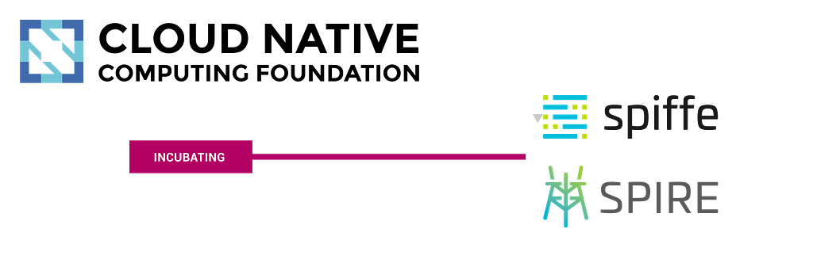

**_SPIFFE/SPIRE move to CNCF Incubation-level hosted projects!_**

We are thrilled to announce the CNCF Technical Oversight Committee (TOC) has voted to promote both SPIFFE and SPIRE projects from sandbox to incubation-level hosted projects!

You can read the official CNCF announcement [here](https://www.cncf.io/blog/2020/06/22/toc-approves-spiffe-and-spire-to-incubation).

The following key contributions from the SPIFFE community launched the project into the incubation level:

-   Attainment of a CII best practices badge of [Passing](https://bestpractices.coreinfrastructure.org/en/projects/3303), and 98% of the [Silver](https://bestpractices.coreinfrastructure.org/en/projects/3303?criteria_level=1) level criteria. The process of earning a badge was the result of concerted improvements to the development process and security practices to “keep the project sustainable, to counter vulnerabilities from entering their software, and to address vulnerabilities when they are found”
-   Conducted a detailed and comprehensive “[Security Self-Assessment](https://docs.google.com/document/d/1PCTrSSpM62S8WLLocb7_UU4XtoHLROp-Q92ZpfLBgeA)” that was vetted by the CNCF Special Interest Group for Security (SIG-Security) and complimented for “due diligence in security and threat modeling”. It was also highlighted that the projects possess an evident security workflow. The summary is available [here](https://github.com/cncf/sig-security/tree/master/assessments/projects/spiffe-spire).
-   Prepared a technical and administrative “[Incubation Due Diligence](https://docs.google.com/document/d/1tkN9YgBSLEUszOflWPHO72qedOaUb3iHfAye45dKJT8/edit#heading=h.378jkvcve1nq)” report, asserting having met all [incubation level criteria](https://github.com/cncf/toc/blob/master/process/graduation_criteria.adoc#incubating-stage). The report is a detailed account of aspects such as project and code quality, governance, alignment with the ecosystem, roadmap, sandbox level progression, user adoption, and governance. The TOC highlighted that SPIFFE and SPIRE accomplished everything expected from a sandbox level project and much more.
-   Prepared and presented to the CNCF a “Year Review” [presentation](https://docs.google.com/presentation/d/1nmw3u_3GahpelA8B-Ltxq70Vt6-MgMibuBiJL2DuVBo/edit#slide=id.g6c10870150_0_0).

Special thanks to the leadership of both projects including maintainers, authors, and the Technical Steering Committee (TSC), as well as the CNCF TOC, and CNCF SIG-Security with special recognition to Justin Cappos, Justin Cormack, Brandon Lum, and Emily Fox. We’d also like to thank all contributors and supporting staff at the CNCF, Hewlett-Packard Enterprise, and the respective employers of contributing members.

We are looking forward to the opportunity that the CNCF Incubation stage offers to carry on our mission of advancing SPIFFE and SPIRE towards the goal of a more secure cloud-native ecosystem!

**New to SPIFFE and SPIRE? Get involved**

To get going with SPIFFE and SPIRE, the best place to start is is [spiffe.io](https://spiffe.io/). From there, have a look at the docs, check out the code on [Github](https://github.com/spiffe/spire), and join our Slack channel. If you are actively looking to deploy, we’d love to hear from you! Know we are here to help.

*This post was [originally published on the SPIFFE Medium blog](https://medium.com/spiffe/spiffe-spire-move-to-cncf-incubation-level-hosted-projects-18ba3ac01ee8).*
