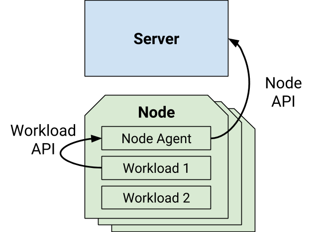

#### Part I: Methodology

_Justin Cappos, Evan Gilman, Matt Moyer, Enrico Schiattarella_

_tl;dr In this post, we introduce the expected security properties of the SPIFFE Runtime Environment (SPIRE), and discuss show how we can begin to systematically estimate the risk of attacks. We establish a threat model based on common deployment scenarios and show how that model helps us make educated guesses about the likelihood and severity of potential vulnerabilities._

### Introduction

A common problem in cloud-based distributed systems is how to authenticate access between components of a system. The [_Secure Production Identity Framework For Everyone (SPIFFE)_](https://spiffe.io/) enables a service to securely obtain an identity from a trusted SPIFFE provider, giving the service a way to authenticate itself and provides a meaningful basis for service-to-service authorization.

We’ve been working to build an understanding of potential security risks in common SPIFFE deployment scenarios. First, we must understand what harm an attacker could inflict. We describe generic attack classes we believe cover many key security properties of a SPIFFE deployment. For example, the security of a SPIFFE deployment requires that a service receive an identity if and only if it has been authorized. This relies on a guarantee that identities cannot be stolen or forged. However, it also means a deployment must be available to issue identities even while under attack.

To give a concrete basis for our analysis, we assess the security of the _SPIFFE Runtime Environment (SPIRE_) [v0.6.1](https://github.com/spiffe/spire/releases/tag/0.6.1), which is one open source implementation of SPIFFE. The goal of this analysis is to uncover weaknesses in the core SPIFFE processes and produce generic recommendations for the SPIFFE specification and all SPIFFE implementations. We aim to document the expected security model for a SPIFFE implementation, show how SPIRE enforces (or fails to enforce) key security properties, and identify gaps where further hardening can have a tangible impact.

We have several important non-goals. We assume a rather generic deployment model which may not match every real-world deployment. We make no judgment about how many times an attack will occur in a year, but instead consider the relative probability and risk of different attacks (that is, the expected damage of various attacks). Finally, we realize that having a 100% secure system is impractical and so will focus on pragmatic changes that have a good cost/benefit ratio.

This post will describe the architecture of a SPIFFE system and describe plausible types of attacks, how they might be launched, and in what scenarios. Part II will continue with our findings and recommended mitigations.

### SPIRE Architecture

*A SPIRE server with connected nodes. Each node has a SPIRE agent that provides identities for workloads on that node.*

#### Workload API

The basic architecture of SPIRE is that each physical or virtual machine, or _node,_ runs a daemon called the _SPIRE agent_. The SPIRE agent is responsible for handing out identities such as X.509 certificates to applications, or _workloads_, running on that node. This interaction between a workload and SPIRE agent happens via the [_SPIFFE Workload API_](https://github.com/spiffe/spiffe/blob/master/standards/SPIFFE_Workload_API.md).

To verify that a workload is authorized for a particular identity, the SPIRE agent performs _workload attestation_. In this process, the SPIRE agent relies on locally-trusted workload attributes such as process/group ID or container runtime metadata. These attributes are read from the kernel or other trusted components on the local system. The SPIRE agent matches the attributes against configured identities, and provides each workload with all the identities for which it is authorized.

A workload may be authorized for zero or more identities. In the case of multiple identities, one is designated as the default to be used if not otherwise configured at the application level. The workload periodically receives updated identity documents as certificates expire or the configuration changes. The SPIRE agent preloads the identities for all workloads it may host. This minimizes the impact of server downtime on the availability of the Workload API.

In practice, many applications may use SPIFFE indirectly via an adaptor sidecar or proxy. In these configurations, the adaptor connects to the Workload API and converts the SPIFFE identity into a format natively usable by the application layer. This does not materially impact the security properties of the system, since the adaptor generally runs in the same security boundary as the application. We consider them a single workload for this analysis.

#### Node API

The SPIRE agent cannot create valid identities from scratch itself. Instead, it connects to a central _SPIRE server_ which is entrusted with the authority to mint identity documents. This interaction happens via the [_SPIRE Node API_](https://github.com/spiffe/spire/blob/0.6.1/proto/api/node/README_pb.md). When a new SPIRE agent comes online, it can bootstrap a node-level identity using _node attestation_. This attestation process is implemented via a plugin and varies significantly by deployment. As a result, we have decided to keep the node attestation flow out of scope for this analysis, and assume that all SPIRE agents have been manually configured with node-level identities.

#### Critical Functions

The identity layer of a distributed system is critical to security because it constitutes the foundation for authorization decisions, as well as other functions like logging and billing.

Some of the critical responsibilities of a SPIFFE implementation are:

-   Generation of workload identities based on workload attributes and system configuration.
-   Attestation of workloads to make sure that workloads can access only identities to which they are entitled.
-   Distribution of identities from the location where they are generated to the location where the workload can consume them.
-   Distribution of _trust bundles_ to workloads, so that they can autonomously validate identities presented by other workloads without the need for an external service.

In a SPIRE deployment, the SPIRE server mints identities, while SPIRE agents perform workload attestation and distribution of identities and trust bundles. The identities given to a workload can determine which upstream services it can access or what type or amount of resources it can consume.

### Security Goals

A workload that cannot reliably verify the ID of other workloads requesting its services must “fail closed” and deny access in order to preserve the security properties of the system. This means that attacks against the availability of the SPIFFE control plane may cascade into reduced availability of workloads.

An attacker may target various aspects of the identity layer depending on their goals. For example, if the goal is to make the system unavailable then disrupting any of the functions (identity generation, distribution, etcetera.) is enough to accomplish it. If the goal is to gain unauthorized access to some resources, the attacker must find ways to steal the identities of legitimate workloads, trick the system into providing an identity to which it is not entitled, compromise one of the components (server, agent, workload), or compromise local security barriers such as network or filesystem namespaces.

Another option is to attack the identity verification function that the workloads perform. For example, an attacker that manages to tamper with the trust bundle a workload uses can mint arbitrary identities and trick the workload into accepting them as genuine.

For the purpose of our analysis, we have grouped attacks into categories based on attacker goals. Note that all attack types can be mounted against all components (server, agent, workloads) with different levels of difficulty and with different impact on the security of the system. Each of these attacks is the inverse of a security goal for SPIFFE. The goal of SPIFFE is to prevent these attacks.

#### Attack: Misrepresentation of Identity

This type of attack tricks the system into issuing identities that exploit weaknesses in the syntax or semantics of the validation of corresponding identity documents. For example, generating certificates with invalid characters or unverified identity attributes, or trust bundles with rogue certificates.

#### Attack: Identity Theft

The purpose of this type of attack is to gain unauthorized access to the identity or key material of another component. For example, a malicious workload may try to impersonate another workload or a compromised SPIRE agent may try to impersonate the server.

#### Attack: Compromise/Remote Code Execution (RCE)

In this type of attack, the attacker seeks to gain full control of one or more components. The victim component can be located on the same host or on another host with network access.

#### Attack: Denial Of Service (DoS)

These attacks disrupt system functionality by overloading or disabling one or more components. For example, a rogue entity can perform a SYN flood attack on the server, or a compromised SPIRE agent can inundate the server with bogus certificate signing requests and prevent it from processing legitimate ones.

### Enumerating Attacker Capabilities

An attacker may need specific capabilities to mount attacks of a certain type. For example, an attack might require network access as well as an exploitable vulnerability in some system component. In some cases the required capabilities are already available to the attacker due to features of the design or of the deployment. In other cases, they must be gained through other means, for example by attacking an infrastructure component such as a network switch or a container execution environment.

The list below summarizes a subset of plausible capabilities that enable interesting attacks on SPIRE. These are hypothetical classes of vulnerabilities in one or more system components. They do not correspond to known vulnerabilities, but are based on our knowledge of the SPIRE codebase and possible attack surface.

-   **None:** Capabilities that are available by design. These are inherent in the design and deployment of SPIFFE or SPIRE.
-   **Hammer:** Asymmetrically generate very large load on the victim component.
-   **Escape:** Escape workload isolation boundaries within a node. For example, using a kernel privilege escalation or other container escape vulnerability.
-   **MitM:** Intercept, eavesdrop, and possibly tamper with network communications between components.
-   **PreAuthProto:** Gain remote code execution or cause a crash by exploiting weaknesses in the pre-authenticated portion of the communication layer (e.g. TLS, Protobuf, gRPC).
-   **X509Vuln:** Gain remote code execution or cause a crash using a vulnerability in X.509 certificate parsing code.
-   **CSRVuln:** Gain remote code execution using a vulnerability in X.509 certificate signing request (CSR) parsing code.
-   **CSROddity:** Break the X.509 certificate signing request (CSR) parser to cause a crash, produce a malformed result, or trigger excessive resource consumption on the processing side (for example, by sending an arbitrarily large CSR or a large number of extensions).
-   **MitigationBypass:** Bypass a mitigating security control in some system component. This allows us to estimate the risk of mitigated vulnerabilities if there is some chance that the mitigation is flawed.

### Applying the Attacks

For the purpose of this analysis, we assume that an actor follows these logical steps in mounting an attack:

1.  Selects the **type** of attack they want to mount based on the final goal.
2.  Selects the **victim**, i.e. the part of the system to attack (server, agent, workload).
3.  Selects the attack **origination point** (server, agent, workload, or an external entity).
4.  Gains the capabilities required to mount the attack and initiate it.

An _attack scenario_ is then represented by the _(type, victim, origination point)_ tuple.

In the first phase of our analysis, we have enumerated all the possible scenarios. For each scenario, we have listed the type of attacks that can be mounted, the capabilities that they require, and the security controls that are in place to mitigate them.

The results are organized in a set of matrices, one for each attack type. The rows and columns identify the victims and origination points, respectively. The content of the cell describes the threats that are applicable in that particular scenario.

We can use these matrices to rank threats to a SPIRE deployment. Specifically, we can estimate the likelihood of attacker possessing each capability, as well as estimating the relative severity of each attack. Joining these two estimates, we produce a heuristically ranked list of potential risks to the system. This list gives us a better understanding of the overall security properties of the system and helps identify practical mitigations that could meaningfully improve its security.

In [Part II](https://medium.com/@moyerma/scrutinizing-spire-to-sensibly-strengthen-spiffe-security-part-two-b8351ee2ff79), we will present findings from our research, including some reassuring properties and areas for incremental improvement.

*This post was [originally published on the SPIFFE Medium blog](https://medium.com/spiffe/scrutinizing-spire-security-9c82ba542019).*
