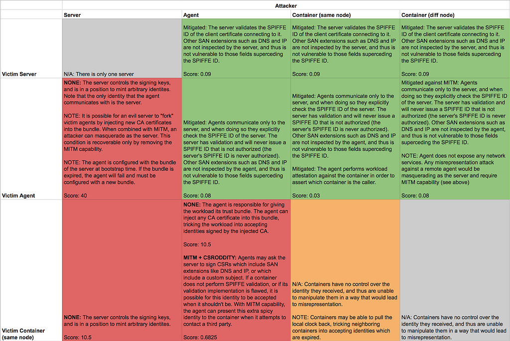

#### Part II: Findings

_Justin Cappos, Evan Gilman, Matt Moyer, Enrico Schiattarella_

### Introduction

In our [previous post](https://medium.com/@moyerma/scrutinizing-spire-security-9c82ba542019), we discussed the architecture of SPIRE / SPIFFE in typical deployment scenarios and described a methodology for enumerating and ranking threats to the security of the system. In this post, we apply that methodology and show the results. We prioritize and rank attacks to understand their severity in practice and use this information to recommend some pragmatic hardening measures.

### Prioritizing the Attacks

Now that we know what kind of attacks are possible, and what would be required in order to mount them, we need a way to quantify the severity of each combination. For example, identity theft is very severe, but if the only way to do it is to discover an exploitable 0-day vulnerability in well-exercised code paths, then the relative risk to SPIRE may not be so high. Preventing a workload from receiving its identities may be less bad, but if you can do it from anywhere and there are no protections to prevent it, then that is really bad! So how can we go about ranking each of these combinations so that we know where to focus our efforts?

To do this, we scored combinations of attack type, the victim, and required capability along two axes: impact and likelihood. The impact score reflects how severe the outcome of the attack is. To understand the severity, we scored combinations of “goal” and “victim”. For instance, “compromise the SPIRE server” or “DoS a neighboring container”, where the former is scored much higher than the latter.

The likelihood score is complementary to the impact score; it reflects how likely a particular attack is, given a set of capabilities that an attacker must obtain in order to mount it. To do this, we scored the capabilities directly. For instance, “container escape vulnerability” or “X.509 buffer overflow”, where the former is scored higher than the latter.

Each audit participant gave their own impact and likelihood scores. At the end of the scoring exercise, we consolidated the scores into a single score for each category by taking the median score of the participants. With scores representing both impact and likelihood, it is possible to assign a composite score to each cell of the attack matrices previously created by multiplying the impact and likelihood score for any given combination.

*A snippet from the “Misrepresentation” attack matrix, showing required capabilities and scores*

Armed with this data, we can begin to understand the most (and least) significant threats, and focus our energy on making measurable gains to the overall security stance.

### Analyzing the Biggest Risks

Of the top ten highest scoring attacks, nine leveraged the **None** capability. In other words, they result from the underlying architecture of the SPIRE system. For example, the top four attacks are identity theft and misrepresentation attacks in which the server is the attacker. These attacks are viable because there is only one server, and it has the root signing key. We could attempt to reduce the exposure area of the signing material itself, but as long as the server can get things signed it doesn’t matter if the key itself is compromised. We could also introduce some multi-party computation, but we believe the complexity of such a mitigation exceeds our current cost/benefit threshold.

The only attack in the top ten not leveraging the **None** capability was a denial of service attack against the server using the **Hammer** capability (refer to [Part I](https://blog.scytale.io/scrutinizing-spire-to-sensibly-strengthen-spiffe-security-part-one-9c82ba542019) for a description of these capabilities). We were aware of this possibility, and it having surfaced in the top ten served to give us some confidence in our methodology.

If we exclude attacks that leverage the **None** capability, the top ten surfaces additional interesting attacks. Another denial of service attack leveraging the **Hammer** capability bubbles up, this time with the agent as a victim. Both of these attacks can mitigated relatively simply by adding rate-limiting controls. We observed other highly-ranked denial of service attacks as well, this time using the **CSROddity** capability.

We believe that examining the top ten highest scoring attacks has proved a useful exercise, resulting in the identification of several attacks that can be mitigated with little effort to measurably raise the security posture of SPIRE. It has also shined a light on the difficulty in building automated online signing services, and raised questions about how we can better protect the overall system in the event of a server compromise.

### Understanding the Lowest Risks

The attacks with the lowest scores are naturally less interesting than those with the highest scores, but still provide a few lessons.

There is a long tail of low-risk attacks. The vast majority of these stem from attacks that require either the **X509Vuln** or **MitigationBypass** capabilities. Prior to this exercise, we speculated that we could improve SPIFFE’s security by avoiding parsing X.509 certificates. The results of the analysis suggest that the risk of these attacks is lower than anticipated, and mitigation efforts may be better spent elsewhere. Similarly, we should not spend time trying to mitigate eventualities that may arise from conditions which are already mitigated. Instead, we should focus on making more meaningful improvements.

### Going Forward

Using the data collected from this exercise, we were able to identify some key areas in which SPIRE already provides reasonable assurance. We’ve also identified some simple incremental improvements that can reduce the risk of some attacks. In many cases, these changes are minimal and quick to implement.

For example, one area of concern was attacks stemming from the **Hammer** capability that could cause a denial of service by overloading the SPIRE server or SPIRE agent. These attacks are well mitigated by some basic rate limiting controls ([spiffe/spire#577](https://github.com/spiffe/spire/pull/577)).

We have also identified some small changes to the SPIFFE mechanisms that make it easier to implement with minimal attack surface. In particular, we can eliminate certificate signing request (CSR) parsing with minimal impact to the protocol semantics. This moves the likelihood of the **CSRVuln** and **CSROddity** to zero, with corresponding reduction in some possible attacks.

Finally, we’ve identified strategies that reduce risk but come at the cost of increased implementation complexity. For example, the SPIRE server and SPIRE agent could use process-level privilege separation to improve the way they handle **X509Vuln** and **CSRVuln** vulnerabilities. We can use the data from this exercise to suggest that these mitigations, while valid, may not be immediately practical from a cost/benefit standpoint.

### Conclusion

In this post, we applied the methodology from [Part I](https://blog.scytale.io/scrutinizing-spire-to-sensibly-strengthen-spiffe-security-part-one-9c82ba542019). We showed how our heuristic estimates of the relative likelihood of potential vulnerabilities, combined with our estimates of the impact of different styles of attacks, have identified practical improvements to the security of SPIRE and other SPIFFE implementations.

We hope this analysis will serve as useful documentation of the expected security properties and threat model of SPIRE for future users and implementers. If you’re interested in contributing to SPIFFE or SPIRE, please [join the community](https://spiffe.io/community/)!

*This post was [originally published on the SPIFFE Medium blog](https://medium.com/spiffe/scrutinizing-spire-to-sensibly-strengthen-spiffe-security-part-two-b8351ee2ff79).*
