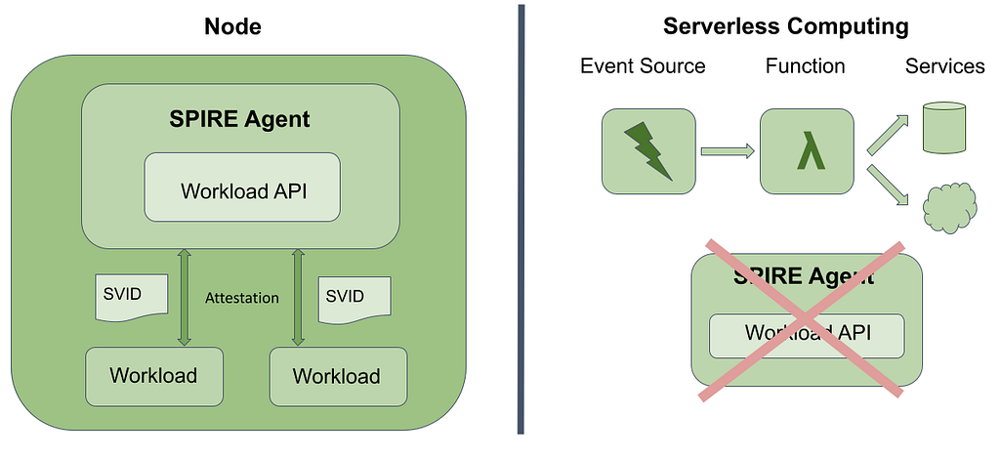
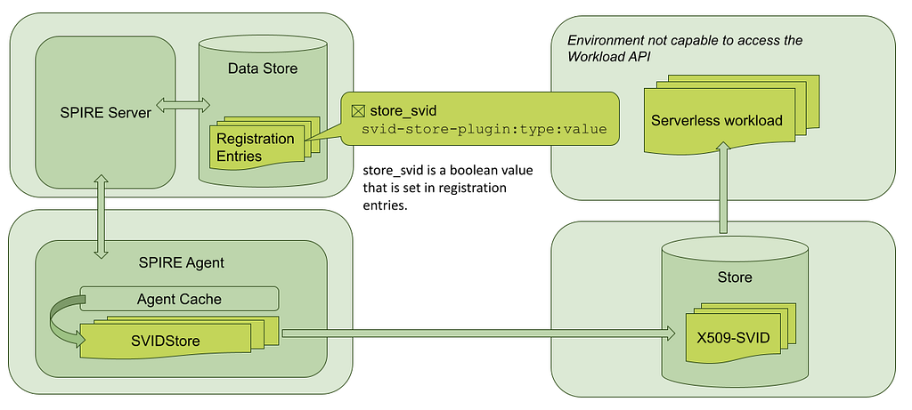

_This blog is co-authored by Agustín Martínez Fayó and Marcos Yacob_

Serverless cloud computing environments such as AWS Lambda and Google Cloud Functions can be beneficial for some applications. The provider handles the work of provisioning the computing infrastructure and users only pay for resources that they use. However, SPIRE Agents can’t be deployed in a serverless environment. This post describes how the new SVIDStore plugin adapts SPIRE to serverless environments.

### Introduction

[SPIRE](https://github.com/spiffe/spire/) (the [SPIFFE](https://spiffe.io/) Runtime Environment) exposes the [SPIFFE Workload API](https://github.com/spiffe/spiffe/blob/master/standards/SPIFFE_Workload_API.md), which can attest running software systems and issue platform-agnostic cryptographic identities — by way of SPIFFE IDs and SVIDs — providing the ability to securely authenticate services in dynamic and heterogeneous environments.

SPIRE comprises two components: the server and the agents. The server authenticates agents and mints SVIDs, while the agent is in charge of serving the SPIFFE Workload API. Providing identities to workloads is the primary purpose of SPIRE Agent, and workloads simply call the Workload API to get their identities. But what happens in environments where a SPIRE Agent can’t be deployed?

Serverless computing is one example of those environments. What usually happens in this scenario is that an event triggers the execution of a function that runs in an execution environment, interacting with different services. We all know the associated benefits of this model of having Functions as a Service: you don’t need to manage servers and you can easily scale resources depending on the load. But the same characteristics that make it so attractive present some challenges. This model where the runtime environment of the function exists just to run the function does not completely fit in the usual way that SPIRE is deployed, where you have a SPIRE Agent next to the workloads that call the Workload API to get their identities. In serverless computing, you can’t call the Workload API from your function because there is no SPIRE Agent to provide access to the Workload API. So we had to look at ways to issue identities to workloads without interacting with the Workload API.

_Regular workload attestation in SPIRE vs. serverless computing_

Different options were explored to solve that problem. One of them was to have the function or workload attest directly to the SPIRE Server to obtain its identity. We saw this pull model attractive for certain scenarios, but at the same time we found some performance and reliability challenges, and the majority of the feedback that we got from the community pointed to a push model rather than a pull model.

Considering that, we also looked at what a push model would look like, where SVIDs would be pushed to platform-specific stores and the function would essentially get the identity material from a predefined store. In that way, SVID management would be moved out of the execution time-frame of the function, solving both the performance problem and the reliability concerns around the dependency on SPIRE Server, that we needed to be available to issue the identity.

### SVIDStore plugins come to rescue

To issue SVIDs to workloads in a serverless environment, the SVIDStore agent plugin type was introduced, allowing agents to store specific SVIDs in a designated store.

We can see in the following diagram how the SVIDStore plugin works.

_Storing SVIDs externally through SVIDStore plugins_

Here we have a basic deployment of SPIRE. As in any regular SPIRE deployment, SPIRE Server has a data store that contains the identity registration entries. SPIRE Agent fetches the identities that are entitled to that agent from the SPIRE Server and keeps the agent cache updated. The SVIDs in the cache are ready to be provided to the workloads through the Workload API.

The new SVIDStore plugin type provides a way to identify the entries that will be used to issue identities to the serverless workloads. What this means in practice is that when a registration entry is created, you are now able to specify — with a newly introduced -storeSVID flag — if you want to store externally the resulting X509-SVID from that entry. This “store” action is done by an SVIDStore plugin that receives the updates from the agent cache, so when there is a new or updated identity, the plugin is notified and called. When that happens, instead of having that identity ready to be fetched through the Workload API, the plugin pushes it to a designated store.

The details of how the identity is stored and the specific attributes that each store requires are specified through the selectors of the entry. For example, if you are using [AWS Secrets Manager as a store](https://github.com/spiffe/spire/blob/main/doc/plugin_agent_svidstore_aws_secretsmanager.md), you will be able to specify — through the selectors of the entry — the secret name where the X509-SVID will be stored.

This provides a pretty flexible mechanism to describe the attributes needed by each specific store platform. Each plugin needs different information to store the X509-SVIDs depending on the underlying platform. The information that is needed to store any of the X509-SVIDs can be specified in the plugin configuration, and the information that is entry-specific is specified in the selectors of the registration entry. We can easily see how this model can help us not only in serverless computing but also in any environment or platform where installing a SPIRE Agent is not possible.

Finally, we see that the workload running in a serverless architecture can fetch its identity from the secrets store in the same way that it gets other secrets. We just need to have a plugin that supports storing the X509-SVIDs in the designated store.

### Conclusion

In this post, we have presented the challenges associated with serverless computing architectures and showed how the introduction of SVIDStore plugins helps in this situation. We saw how different approaches were analyzed, exposing the benefits of being able to store X509-SVIDs in specific stores through a push model, considering the current needs of the community and the project. We also revealed how these plugins can help us in any platform where SPIRE Agent can’t run, not just in serverless computing architectures.

*This post was [originally published on the SPIFFE Medium blog](https://medium.com/spiffe/enabling-authenticated-communication-for-serverless-workloads-with-spire-d636bf2f7a91).*
