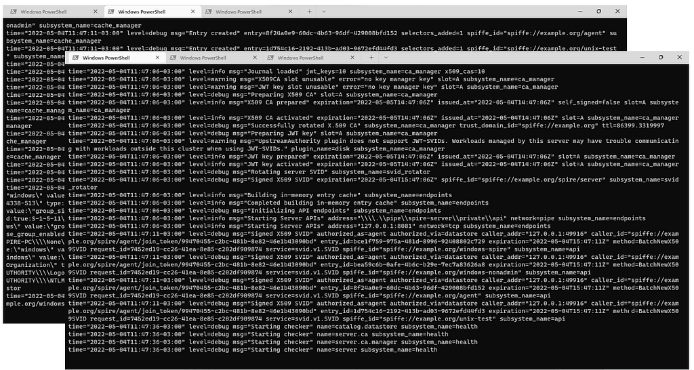

At its heart, the [SPIRE project](https://github.com/spiffe/spire/) aims to solve the problem of securely issuing workload identities at scale, no matter where the workload is running. It does that by having an extensible architecture composed of plugins that allow SPIRE to grow depending on the needs of supporting different platforms, cloud providers, etc. Until now, SPIRE could only be deployed on Linux platforms. But that is now a thing of the past with the new experimental Windows support in SPIRE 1.3.0!

### What kind of support is being introduced?

Over the years, SPIRE, a production-ready implementation of the [SPIFFE](https://spiffe.io/) standards, has gained a high degree of maturity on Linux platforms. We have learned a lot in terms of how SPIRE is deployed, operated, and integrated into a variety of Linux environments.

Windows support is being introduced incrementally as an [experimental feature](https://github.com/spiffe/spire/blob/main/doc/upgrading.md#experimental-features). We anticipate that as our operational experience with Windows evolves, changes that impact the user experience or functionality will need to be introduced. We will be working hard to fill the gaps and stabilize Windows support over the next several SPIRE releases.

The 1.3.0 release adds support for running both the SPIRE Server and Agent on Windows. Existing plugins have been adapted to work under Windows, where applicable. In addition, a new Windows-specific workload attestor has been added (similar to the existing Unix workload attestor) for providing Windows-specific attributes to Windows workloads.

### What’s the difference?

One guiding principle of the SPIRE project is to strive for ease-of-use and intuitive configuration. With that in mind, running SPIRE on Windows feels very similar to running it on Linux. Configuration differences are limited to areas where platform specific features are in use (e.g. Unix Domain Sockets, named pipes, etc).

_SPIRE running on Windows_

### The work that we have ahead

Supporting SPIRE on an additional operating system is not a trivial task. As we pointed out, SPIRE has been growing in maturity and stability on Linux platforms over several years. We know that we will need to work across several releases to provide a similar level of feature parity with what we have today on Linux platforms. We have a lot of work ahead in multiple dimensions:

-   The [SPIFFE Workload Endpoint](https://github.com/spiffe/spiffe/blob/main/standards/SPIFFE_Workload_Endpoint.md) standard does not yet support exposing the Workload API as a named pipe endpoint. We will be working closely with the SPIFFE [SIG Spec group](https://github.com/spiffe/spiffe/tree/main/community/sig-spec) to update the specification to standardize the way that SPIFFE implementers (like SPIRE) can use named pipes to serve and consume the Workload API.
-   The K8s workload attestor plugin is not yet supported on Windows due to a difference in support for key K8s features that we rely on to attest K8s-based workloads. We are actively investigating alternative means to attest Windows workloads running in K8s.
-   While the go-spiffe library has been updated to support the use of named pipes with the Workload API, other language libraries have not. This is in part due to a lack of support for named pipe transports in the C/C++ gRPC library. We have work to do to provide this support, which may include collaborating with others in the ecosystem to develop and upstream requisite changes to libraries like gRPC.

### We want to hear from you

Though support for Windows is very new, we’ve collaborated with interested community members to design and verify the current feature set. SPIRE is already running in test environments, with plans to deploy to thousands of Windows hosts. This early adoption has been and will continue to be integral to stabilizing our support. We are very eager to learn more from the community and early adopters how we can better support providing secure service identity to workloads running in Windows environments.

If you have requests or anything to say about this new support, we want to hear! Please don’t hesitate to open an issue in the [GitHub repository](https://github.com/spiffe/spire/issues) asking for a feature or to report a bug. Also, you can join the awesome SPIFFE community on Slack: [https://slack.spiffe.io/](https://slack.spiffe.io/). We will be happy to answer your questions and discuss your requests. Lastly, if you want to be up to date on all the news for the project, join the SPIFFE Announce mailing group, which is a low frequency list of project announcements: [https://groups.google.com/a/spiffe.io/g/announce](https://groups.google.com/a/spiffe.io/g/announce).

*This post was [originally published on the SPIFFE Medium blog](https://medium.com/spiffe/spire-now-runs-on-windows-7e4c7933210b).*
