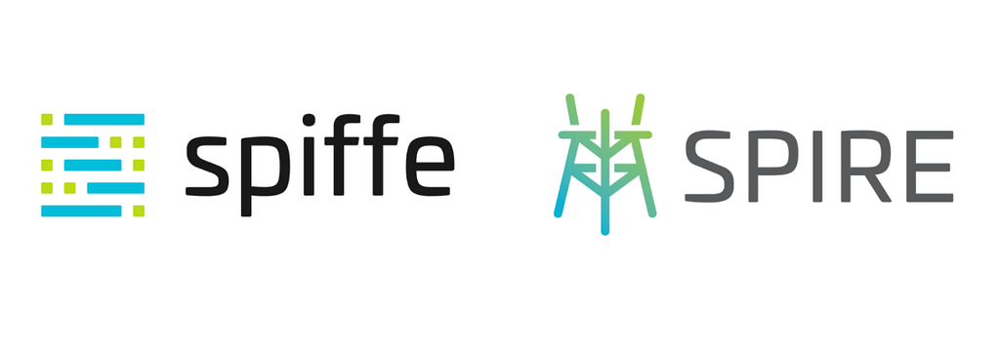

In the era of cloud-native applications and microservice architectures, new challenges and needs arise as well as technologies that address these necessities. One such solution, service meshes are an infrastructure layer that abstract observability, traffic management, and security away from application code.

### Service Meshes

With the migration from monolithic to microservices paradigms, application management became more complex and difficult to secure. The transition to public clouds amplified the necessity for better solutions for security challenges and the conventional perimeter defense patterns had to evolve to deal with the new attack surface that is now spread over multiple services.

Since an application structured in a microservices architecture might comprise dozens or hundreds of services, it’s a big challenge for developers to keep track of which components must interact, monitor their health and performance, and make changes to a service or component if something goes wrong.

A service mesh solves the problem of managing numerous services by providing a dedicated infrastructure layer that controls service-to-service communication over a network. This method enables separate parts of an application to communicate with each other.

**Istio**, an open-source service mesh initially created by Google, IBM, and Lyft, is a universal control plane originally targeted for Kubernetes deployments, but architects can use it on multiple platforms. Its data plane relies on proxies called Envoy sidecars. Istio service mesh is the most popular mesh in use nowadays, according to [a 2020 CNCF survey](https://www.cncf.io/wp-content/uploads/2020/11/CNCF_Survey_Report_2020.pdf).

### Security Concerns

When network management complexity is abstracted and centralized, it is necessary to improve its security. In consequence of this demand, interoperability among workloads requires great control of the workload-to-workload communication, especially when dealing with multi-cloud infrastructure.

### SPIFFE and SPIRE

**SPIFFE**, the Secure Production Identity Framework for Everyone, is a set of open-source standards for securely identifying software systems in dynamic and heterogeneous environments. Systems that adopt SPIFFE can easily and reliably mutually authenticate wherever they are running. SPIRE is a reference implementation of SPIFFE that supports the zero-trust security framework providing strong secure identity management functionality across heterogeneous infrastructures.

### Integrating SPIRE into Istio

Integrating Istio and SPIRE enables a secure uniform identity framework and fine-grained policy management across distributed environments, especially edge-to-cloud deployments, as it strengthens the zero-trust security architecture for these environments.

This approach removes the responsibility of the istio-agent that was used to generate key pairs and certificate requests (CRs), by allowing Envoy Secret Discovery Service (SDS) to fetch cryptography information generated by SPIRE.

If you want to know more about this integration, check out the proposal [RFC: Istio CA integration through Envoy SDS](https://docs.google.com/document/d/1zJP6QJukLzckTbdY42ZMLkulGXz4gWzH9SwOh4xoe0A/edit?usp=sharing). A future release of Istio will include the SPIRE integration, making it an official part of Istio. [Here is an example](https://github.com/istio/istio/pull/37948) of how to use this integration. Any questions or suggestions? Comment in the #istio-integration channel in the [SPIFFE Slack](https://slack.spiffe.io).

> Support for @SPIFFEio SPIRE has just been merged into the @IstioMesh project 🎉 Congrats to @MaxLambrecht and team 👏 a super longstanding community request. Check out the docs and give it a spin! 😍
>
> — Evan Gilman

*This post was [originally published on the SPIFFE Medium blog](https://medium.com/spiffe/hardening-istio-security-with-spire-d2f4f98f7a63).*
